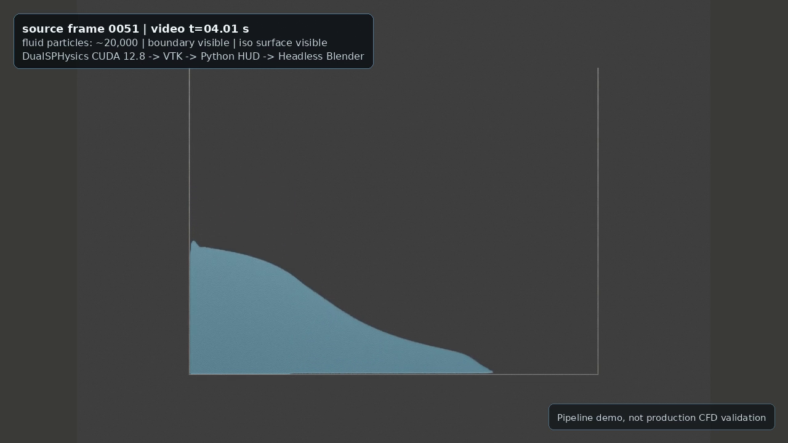

# DualSPHysics CUDA To Headless Blender Visualization Pipeline

Reproducible DualSPHysics CUDA to headless Blender visualization pipeline for
small free-surface SPH portfolio demos.

The active reproducible path is:

```text
DualSPHysics CUDA 12.8
    -> VTK subset export
    -> Python legacy VTK parser
    -> portable Blender headless render
    -> MP4
```

This repository intentionally does not vendor DualSPHysics, VisualSPHysics,
Blender, VTK, CUDA, generated simulation outputs, MP4 files, raw frames, `.blend`
files, logs, or large render artifacts.

## Public Position

This is a visualization-pipeline demo, not production CFD validation. The
dam-break case is a small portfolio preview used to show a reproducible
GPU-to-render workflow. It should not be presented as atomization, spray, or
production multiphase-physics validation.

## Status

- Active renderer: direct Blender VTK fallback using
  `scripts/blender_import_legacy_vtk.py`.
- Final video pipeline: committed source/docs; MP4 generated locally outside
  Git.
- VisualSPHysics: investigated, but full build is held for now because
  `vtkimporter` and `diffuseparticles` require VTK development metadata and
  Blender-compatible Python extension modules.
- Portable Blender: used headlessly through a user-space wrapper such as
  `$HOME/bin/blender-portable`.

See:

- `docs/visualsphysics_decision.md`
- `docs/walkthrough_dualsphysics_to_blender.md`
- `docs/troubleshooting.md`
- `docs/cloud_extension_plan.md`
- `docs/video_metadata.md`
- `docs/video_publish_notes.md`
- `docs/dualsphysics_rectangular_highspeed_jet_proxy.md`
- `docs/jet_workflow_feasibility_20260608.md`
- `docs/basilisk_jet_showcase.md`

## What Developers Can Learn

- How to keep solver outputs, render frames, MP4s, logs, and manifests under
  stable `$HOME/stack-validation/...` paths instead of transient `/tmp`
  locations.
- How to move from solver-generated data to public media:
  DualSPHysics GPU output -> VTK/IsoSurface -> headless Blender -> ffmpeg.
- How to document reproducible command patterns without committing large BI4,
  VTK/VTP, frame, `.blend`, log, or MP4 artifacts.
- Why particle rendering is useful for SPH provenance, while reconstructed
  surface rendering can be clearer for water-like free-surface presentation.
- How velocity-magnitude analysis views can add scientific context without
  claiming physical validation.
- How to debug common release blockers such as missing full-package examples,
  executable permissions after ZIP extraction, lost `/tmp` artifacts, and
  static/incorrect MP4 assembly.
- How to describe future cloud extensions as roadmap work rather than deployed
  Google Cloud, Gemini, or Vertex AI implementation.

## 3D Jet/Spray Showcase Fallback

The official DualSPHysics 3D inlet/open-boundary XML examples are documented
locally but were not present in the current checkout, so this repo now includes
a bounded Basilisk fallback for a solver-generated 3D VOF jet visualization
smoke test.

The fallback path is:

```text
Basilisk tiny 3D VOF smoke case
    -> per-frame liquid/interface CSV
    -> legacy VTK point clouds
    -> preliminary slice geometry proxy metrics
    -> headless Blender point-cloud render
    -> MP4/contact sheet outside Git
```

Latest local smoke result:

- Case: `cases/basilisk/tiny_atomisation3d_export.c`
- Runner: `scripts/run_basilisk_jet_showcase.py`
- Renderer: `scripts/blender_render_basilisk_showcase.py`
- Stable convenience command: `scripts/run_basilisk_jet_showcase_stable.sh`
- Output root pattern:
  `/home/franco/stack-validation/YYYYMMDD-basilisk-jet-showcase`
- Frames: `5`
- Raw VOF-cell rows: `1162`
- Preliminary slice-metric rows: `25`
- Render: `1280 x 720`, five-frame MP4 assembled outside Git
- Caveat: solver-generated 3D VOF smoke/export case only; not validated
  atomization, not production CFD, and not experimental agreement

**Update (2026-06):** Official `05_ShapesInlet3D` was recovered from the full v5.4 package,
permissions fixed, and the GPU case executed successfully to 100 parts with VTK outputs
generated by the official script. Headless Blender render produced a repaired
1280x720 MP4 (~11s animation-only, plus a titled version) and contact sheet from
all 101 PartFluid frames. A cleaner branded render package was also produced
from the same VTK frames with smoother particle markers, no text over the fluid,
and short intro/outro identity cards. The current recommended review artifact is
a v2 fixed-camera multiview showcase with oblique, side/profile, top/plan, and
velocity-colored analysis segments. See
`docs/dualsphysics_shapesinlet3d_showcase.md` for paths, params, repair notes,
and caveats. All heavy artifacts remain outside Git.

**Surface render update:** A follow-up pass used the official
`IsoSurface_linux64` postprocessor on the existing `05_ShapesInlet3D` BI4
outputs and rendered the reconstructed VTK surface in headless Blender. This
surface version is smoother and more water-like than the raw particle-cloud
view, but it is still a visualization workflow preview, not atomization or CFD
validation.

**Accepted scientific-demonstration artifact:** The accepted v1 video stitches
particle provenance, reconstructed free surface, and velocity-magnitude analysis
views into one 34.75 s H.264 MP4. Large media are generated and hosted manually
outside Git; the YouTube-hosted copy is linked below, and the accepted local
artifact set is under
`/home/franco/stack-validation/20260611-dualsphysics-shapesinlet3d-accepted-v1`.

Watch: [3D Inlet-Flow Scientific Demonstration](https://youtu.be/eMUbVgLRkHY)

Caption: Visualization and post-processing demonstration; not physical
validation.

## Rectangular High-Speed Jet Proxy

A modified `06_Box4Inlet3D` run keeps one rectangular inlet, raises the inlet
speed from `2 m/s` to `4 m/s`, and exports particle VTK, IsoSurface, fixed-camera
Blender previews, and preliminary slice geometry metrics under
`$HOME/stack-validation/20260612-dualsphysics-rectangular-highspeed-jet`.

An upgraded long-domain package is also available under
`$HOME/stack-validation/20260612-dualsphysics-rectangular-jet-upgrade`. It uses
the same one-rectangular-inlet framing with finer spacing, a larger downstream
domain, `12 m/s` inlet speed, particle and IsoSurface post-processing,
preliminary slice metrics, and a stitched particle/surface/velocity showcase
video outside Git.

Accepted v2 rebuild: `$HOME/stack-validation/20260612-dualsphysics-rectangular-jet-v2`.
This version uses a copied `v2` profile with one rectangular inlet, `15 m/s`
velocity, `dp=0.025`, an open downstream boundary in the generated box, about
`34.7` equivalent nozzle diameters of measured axial coverage, and accepted
particle/surface/velocity render artifacts outside Git.

Streamwise-gravity v3 rebuild:
`$HOME/stack-validation/20260612-dualsphysics-rectangular-jet-v3-streamwise-gravity`.
This version aligns gravity with the `+x` jet axis, uses `20 m/s`, extends the
measured axial range to about `63.2` equivalent nozzle diameters, and adds
transparent-water IsoSurface rendering, pressure and velocity-magnitude views,
and moving-slice geometry diagnostics outside Git.

Extended-surface v4 rebuild:
`$HOME/stack-validation/20260612-dualsphysics-rectangular-jet-v4-extended-surface`.
This version doubles the v3 duration to `1.7 s`, keeps streamwise gravity and
`20 m/s`, extends measured axial coverage to about `138` equivalent nozzle
diameters, and adds studio-environment transparent-water rendering, final-frame
surface inspection, pressure/velocity/proxy-energy views, and true
plane/IsoSurface cross-section cuts driven by a traced particle ID.

This is a modified DualSPHysics inlet-jet geometry proxy. It is not a fully
atomized spray simulation, not validation, not production CFD, and not
experimental agreement. See
`docs/dualsphysics_rectangular_highspeed_jet_proxy.md`.

## Preview

The committed still below is a small direct Blender VTK fallback preview. It is
intended for quick repository review only; source VTK files and full validation
artifacts stay outside Git.


The safe four-frame contact sheet uses frames `0000`, `0050`, `0100`, and
`0150`. Frame `0200` was excluded after QA because it showed a data-level late
rebound/free-surface cavity that could be misread as a render defect.


Caption: DualSPHysics dam-break visualization-pipeline preview rendered
headlessly in Blender from prepared legacy VTK frames. Safe four-frame sequence,
frames `0000-0150`.

## Video

The front-view dam-break MP4 was generated locally and intentionally not
committed. Example local artifact path, replace as needed:

```text
$HOME/stack-validation/20260607-0219-dambreak-frontview-final-video/dambreak2d_frontview_final_0000_0150.mp4
```

Committed thumbnail and hosted video:

[](https://youtu.be/EDUGMpGn5MI)

Final video facts:

- Duration: about `22.7 s`
- Resolution: `1280 x 720`
- Codec/pixel format: H.264 / `yuv420p`
- View: front orthographic
- Title card: `6 s`
- Closing card: `5 s`
- Frame `0200`: excluded
- Hosted manually outside Git: <https://youtu.be/EDUGMpGn5MI>

Caption: GPU SPH to Blender workflow demonstration; not production CFD
validation.

## VisualSPHysics Decision

VisualSPHysics was investigated as a Blender visualization layer. A disposable
UI registration patch showed that its UI can register headlessly in Blender 4.5
after guarded imports, but the real data path still depends on compiled modules:

- `vtkimporter`
- `diffuseparticles`

Those modules require VTK development headers/CMake metadata and extension
modules compatible with portable Blender's Python 3.11 ABI. The active
reproducible path for this portfolio is therefore the direct Blender VTK
fallback, not a full VisualSPHysics build.

## Validated Machine Summary

- Host: `frontera`
- OS: Ubuntu 24.04
- CPU: Intel Core Ultra 9 275HX, 24 threads
- RAM: about 30 GiB usable
- GPU: NVIDIA GeForce RTX 5070 Laptop GPU, about 8 GB VRAM
- NVIDIA driver: `595.71.05`
- Active DualSPHysics CUDA toolkit: `/usr/local/cuda-12.8`
- DualSPHysics GPU executable: validated for small local examples

## DualSPHysics CUDA 12.8 Wrapper

Canonical local wrapper pattern:

```bash
DUALSPHYSICS_WRAPPER=${DUALSPHYSICS_WRAPPER:-$HOME/bin/dualsphysics5.4-cuda128}
```

Example local target executable, replace for your installation:

```bash
$HOME/opt/dualsphysics/DualSPHysics-cuda128-YYYYMMDD/bin/linux/DualSPHysics5.4_linux64
```

Safe usage pattern:

```bash
"$DUALSPHYSICS_WRAPPER" -gpu CASE_INPUT OUTPUT_DIR
```

## Renderer Controls

`scripts/blender_import_legacy_vtk.py` imports a narrow legacy VTK `POLYDATA`
subset directly inside Blender. It supports ASCII or big-endian binary `POINTS`,
triangular `POLYGONS`, and simple point `SCALARS`/`VECTORS`.

Current render controls include:

- Camera presets: `isometric`, `front`, `front-ortho`, `side`, `top`, `close`.
- Orthographic control: `--ortho-scale`.
- Camera lens control: `--camera-lens`.
- Point visibility/downsampling: `--hide-fluid`, `--fluid-stride`,
  `--boundary-stride`, `--marker-scale`.
- Surface visibility: `--hide-iso`.
- Style/material controls: `--style-preset`, `--fluid-color`,
  `--boundary-color`, `--iso-color`, `--background-color`.
- Light controls: `--light-energy`, `--light-size`, `--light-offset`.
- Render quality controls: `--samples`, `--ambient-occlusion`,
  `--no-ambient-occlusion`, `--contact-shadows`, `--no-contact-shadows`.
- Caption controls: `--caption`, `--caption-size`, `--no-caption`.
- Optional `.blend` output: `--blend`, kept outside Git.

`scripts/assemble_dambreak_video.py` assembles already-rendered PNG frames into
an MP4 and supports:

- title and subtitle text,
- closing card text,
- title/closing/simulation durations,
- FPS and output size,
- HUD text for frame/time, particle count, toolchain, and render path,
- HUD timing and alpha controls: `--seconds-per-frame-index`, `--hud-alpha`,
- card/HUD color controls: `--background`, `--foreground`, `--accent`,
- optional QR placeholder controls: `--qr-placeholder`,
  `--qr-placeholder-text`.

## Commands

### 1. Run A Small Smoke Case

```bash
DUALSPHYSICS_CASE=${DUALSPHYSICS_CASE:-$HOME/opt/dualsphysics/DualSPHysics-cuda128-YYYYMMDD/examples/main/01_DamBreak/CaseDambreakVal2D_Def.xml}

scripts/run_smoke_case.sh \
  "$DUALSPHYSICS_CASE" \
  outputs/dambreak-smoke
```

Generated case outputs should remain outside Git or in ignored local output
directories.

### 2. Export A Small VTK Subset

```bash
VTK_SOURCE=${VTK_SOURCE:-$HOME/stack-validation/YYYYMMDD-HHMM-dualsphysics-vtk-prep/vtk}

MAX_FILES=15 MAX_BYTES=20000000 \
  scripts/export_vtk_subset.sh \
  "$VTK_SOURCE" \
  outputs/vtk-subset
```

The export script copies only a bounded subset of `.vtk`, `.vtp`, or `.vtu`
files. Raw VTK files are ignored and should not be committed.

### 3. Render One Front-Orthographic Frame

```bash
VALID=${VALID:-$HOME/stack-validation/YYYYMMDD-HHMM-single-frame-render}
VTK=${VTK:-$HOME/stack-validation/YYYYMMDD-HHMM-dualsphysics-vtk-prep/vtk}
BLENDER=${BLENDER:-$HOME/bin/blender-portable}
mkdir -p "$VALID/renders" "$VALID/blender-config" "$VALID/blender-scripts"
export BLENDER_USER_CONFIG="$VALID/blender-config"
export BLENDER_USER_SCRIPTS="$VALID/blender-scripts"

"$BLENDER" --background \
  --python scripts/blender_import_legacy_vtk.py -- \
  --fluid "$VTK/dambreak2d_fluid_0100.vtk" \
  --boundary "$VTK/dambreak2d_boundary_0100.vtk" \
  --iso "$VTK/dambreak2d_iso_0100.vtk" \
  --output "$VALID/renders/dambreak2d_front_0100.png" \
  --camera-preset front-ortho \
  --ortho-scale 6.2 \
  --fluid-stride 6 \
  --boundary-stride 1 \
  --marker-scale 0.22 \
  --resolution 1280 \
  --style-preset polished \
  --light-energy 850 \
  --light-size 1.8 \
  --light-offset 0.0,-1.25,1.25 \
  --fluid-color 0.18,0.58,0.95,0.16 \
  --iso-color 0.36,0.78,1.0,0.48 \
  --boundary-color 0.78,0.76,0.70,1.0 \
  --ambient-occlusion \
  --contact-shadows \
  --no-caption
```

Use `--hide-fluid` for a cleaner iso-surface-only preview when particle markers
are visually distracting.

### 4. Assemble A Front-View MP4 From Rendered Frames

This command expects PNG frames that have already been rendered outside Git.

```bash
VALID=${VALID:-$HOME/stack-validation/YYYYMMDD-HHMM-dambreak-frontview-video}

python3 scripts/assemble_dambreak_video.py \
  --input "$VALID/frames/raw/dambreak2d_front_0000.png" \
  --input "$VALID/frames/raw/dambreak2d_front_0050.png" \
  --input "$VALID/frames/raw/dambreak2d_front_0100.png" \
  --input "$VALID/frames/raw/dambreak2d_front_0150.png" \
  --frames-dir "$VALID/frames/final" \
  --output "$VALID/dambreak2d_frontview_preview.mp4" \
  --title "DualSPHysics To Headless Blender" \
  --subtitle "Small dam-break visualization-pipeline demo, not production CFD validation" \
  --closing-title "DualSPHysics CUDA -> VTK -> Python -> Headless Blender -> MP4" \
  --closing-subtitle "Frames 0000-0150; frame 0200 excluded after QA" \
  --title-duration 6 \
  --closing-duration 5 \
  --sim-frame-duration 1.0 \
  --fps 24 \
  --width 1280 \
  --height 720 \
  --particle-text "Particles: small prepared VTK subset" \
  --platform-text "DualSPHysics CUDA 12.8 | RTX 5070 Laptop GPU" \
  --render-text "Python legacy VTK parser | Headless Blender render"
```

For the final overnight video, 76 source frames from `0000-0150` step `2` were
rendered front-orthographic and interpolated to 24 fps before HUD/card assembly.
The MP4 stays in a local generated-artifact directory outside Git and is not
committed.

## Reproducible Pipeline

```text
DualSPHysics XML case
        |
        v
GenCase geometry/particle generation
        |
        v
DualSPHysics GPU run via CUDA 12.8 wrapper
        |
        v
Small VTK/output subset export
        |
        v
Python legacy VTK parser inside portable Blender
        |
        v
Headless Blender PNG renders
        |
        v
Python HUD/title/closing card assembly
        |
        v
MP4 for manual external hosting
```

## Scripts

- `scripts/run_smoke_case.sh`: run a small DualSPHysics smoke case through the
  CUDA 12.8 wrapper.
- `scripts/export_vtk_subset.sh`: copy a bounded number of small VTK files into
  a local output subset for visualization testing.
- `scripts/blender_headless_smoke.py`: minimal Blender Python smoke script for
  isolated add-on install/enable checks.
- `scripts/blender_import_legacy_vtk.py`: direct Blender fallback importer for
  small legacy DualSPHysics VTK `POLYDATA` previews.
- `scripts/assemble_dambreak_video.py`: assemble rendered PNG frames into a
  title/HUD/closing-card MP4.

## Data Policy

Do not commit generated datasets above 20 MB. Large VTK, CSV, logs, MP4, render
frames, `.blend` files, and simulation outputs are ignored by `.gitignore` and
should remain under a local generated-artifact directory or another documented
external output directory.

## Current External Reports

Small summaries are kept in `reports/`. Full logs remain outside this repo in
local generated-artifact directories. Example report directory names:

- `20260606-1952-dualsphysics-benchmark-rerun/report.md`
- `20260606-2248-visualsphysics-preflight/report.md`
- `20260606-2252-visualsphysics-headless-smoke/report.md`
- `20260606-2311-blender-vtk-fallback/report.md`
- `20260607-0219-dambreak-frontview-final-video/report.md`
