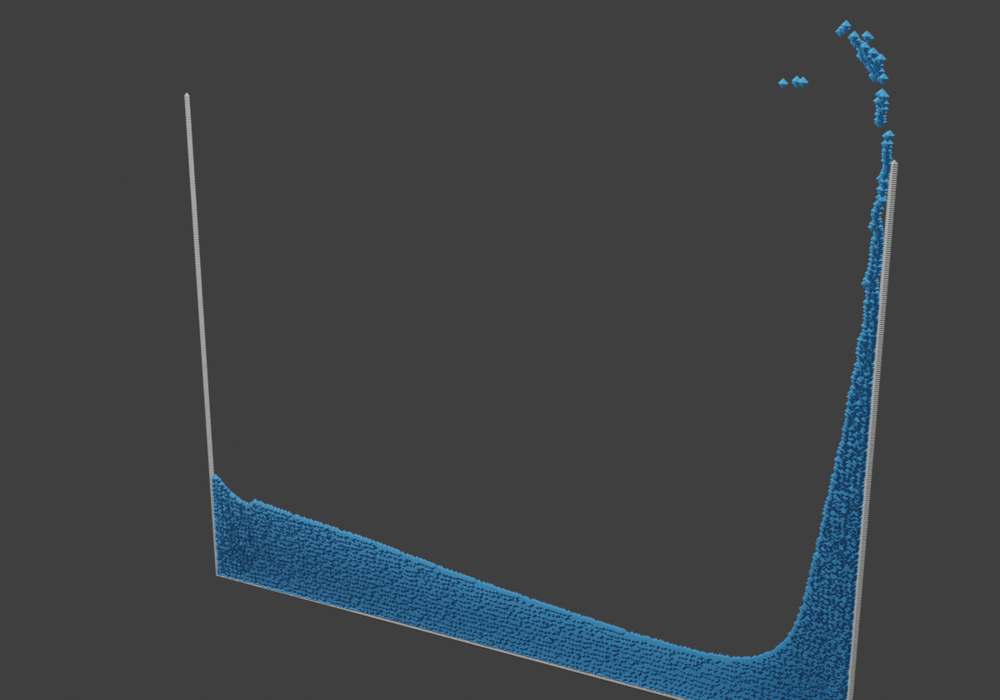
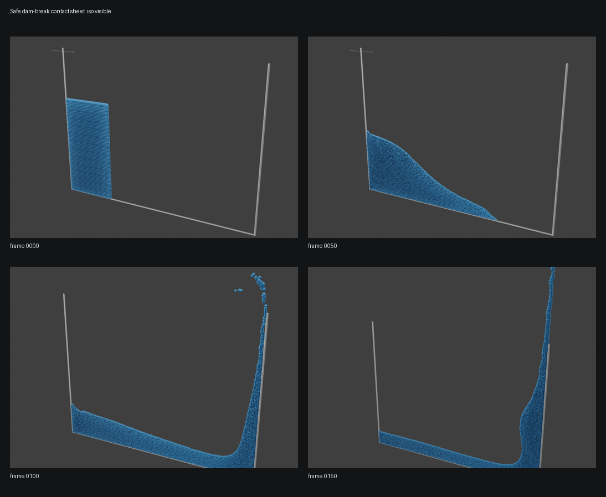

# DualSPHysics + VisualSPHysics Portfolio Pipeline

Lightweight portfolio scaffold for a reproducible GPU SPH visualization pipeline:
DualSPHysics produces free-surface/multiphase particle data, and VisualSPHysics
is the planned Blender visualization layer for stills and animations.

This repository intentionally does not vendor DualSPHysics, VisualSPHysics,
Blender, VTK, CUDA, or generated simulation outputs.

## Status

- VisualSPHysics full add-on path: held pending VTK/Blender ABI compatibility
  for compiled VTK Python modules inside the portable Blender runtime.
- Blender fallback path: works headlessly with `scripts/blender_import_legacy_vtk.py`
  on the small legacy VTK subset prepared under `~/stack-validation/...`.
- See `docs/visualsphysics_decision.md` for the VisualSPHysics build decision.

## Preview

The committed preview below is a small still from the direct Blender fallback.
It is intended for quick repository review only; source VTK files and full
validation artifacts stay outside Git.



The safe four-frame sequence below uses frames `0000`, `0050`, `0100`, and
`0150`. Frame `0200` was excluded after QA because it showed a data-level late
rebound/free-surface cavity that could be misread as a render defect.



Caption: DualSPHysics dam-break validation rendered headlessly in Blender from
prepared legacy VTK frames. Safe four-frame sequence, frames 0000-0150.

## Validated Machine Summary

- Host: `frontera`
- OS: Ubuntu 24.04
- CPU: Intel Core Ultra 9 275HX, 24 threads
- RAM: about 30 GiB usable
- GPU: NVIDIA GeForce RTX 5070 Laptop GPU, about 8 GB VRAM
- NVIDIA driver: `595.71.05`
- Active DualSPHysics CUDA toolkit: `/usr/local/cuda-12.8`
- DualSPHysics GPU executable: validated
- VisualSPHysics/Blender status: portable Blender is available; VisualSPHysics
  is held pending VTK compiled Python modules compatible with that Blender
  runtime

## DualSPHysics CUDA 12.8 Wrapper

Canonical local wrapper:

```bash
/home/franco/bin/dualsphysics5.4-cuda128
```

Known target executable:

```bash
/home/franco/opt/dualsphysics/DualSPHysics-cuda128-20260606-0340-retry2/bin/linux/DualSPHysics5.4_linux64
```

Safe usage pattern:

```bash
/home/franco/bin/dualsphysics5.4-cuda128 -gpu CASE_INPUT OUTPUT_DIR
```

## VisualSPHysics Role

VisualSPHysics is intended to import DualSPHysics outputs into Blender for
portfolio-grade visualization: water surfaces, particle effects, camera paths,
lighting, and short render clips. It is a visualization layer, not the solver.

Current local status:

- Portable Blender wrapper: `/home/franco/bin/blender-portable`.
- No VisualSPHysics add-on zip/source artifact is currently present locally.
- VTK development headers/pkg-config metadata were not visible in the initial
  preflight, and the VisualSPHysics path remains held until VTK Python modules
  are compiled/packaged for the portable Blender environment.
- Headless validation should use isolated Blender config directories and
  `blender --background`.

## Direct Blender VTK Fallback

The fallback path bypasses VisualSPHysics and VTK Python bindings. It imports a
small DualSPHysics legacy VTK subset directly in Blender using a narrow parser:

```bash
/home/franco/bin/blender-portable --background \
  --python scripts/blender_import_legacy_vtk.py -- \
  --fluid /path/to/dambreak2d_fluid_0100.vtk \
  --boundary /path/to/dambreak2d_boundary_0100.vtk \
  --iso /path/to/dambreak2d_iso_0100.vtk \
  --output /tmp/dambreak2d_vtk_fallback_0100.png \
  --camera-preset isometric \
  --fluid-stride 2 \
  --boundary-stride 1 \
  --marker-scale 1.0 \
  --resolution 1200
```

The importer supports the subset produced by the local DualSPHysics VTK prep:
legacy `POLYDATA`, ASCII or big-endian binary `POINTS`, triangular `POLYGONS`,
and simple point `SCALARS`/`VECTORS`. It is a portfolio fallback for small stills,
not a general VTK replacement.

Renderer controls:

- `--camera-preset`: `isometric`, `front`, `side`, `top`, or `close`.
- `--fluid-stride` / `--boundary-stride`: downsample point markers for lighter
  preview renders.
- `--marker-scale`: multiply particle marker size.
- `--fluid-color`, `--boundary-color`, `--iso-color`, `--background-color`:
  accept `#RRGGBB[AA]` or `r,g,b[,a]` values.
- `--resolution`: output width in pixels; height is set to 70% of width.
- `--hide-iso`: render only fluid and boundary particle markers.

## Reproducible Pipeline

```text
DualSPHysics XML case
        |
        v
GenCase geometry/particle generation
        |
        v
DualSPHysics GPU run via CUDA 12.8 wrapper
        |
        v
Small VTK/output subset export
        |
        +-----------------------------+
        |                             |
        v                             v
VisualSPHysics target path      Direct Blender fallback
(held pending compatible        scripts/blender_import_legacy_vtk.py
 VTK Python modules)            no VisualSPHysics, no VTK Python
        |                             |
        v                             v
Portfolio stills / clips        Small still-image preview / .blend
        \_____________________________/
                      |
                      v
        Reproducible portfolio report
```

## Portfolio Narrative

This project demonstrates a local GPU-backed SPH workflow for free-surface and
multiphase CFD visualization. The research angle is pressure-atomized turbulent
liquid jet work; the portfolio angle is a reproducible path from validated GPU
simulation to Blender-based visual communication.

The intended message is narrow and defensible:

- DualSPHysics validates local CUDA/SPH capability.
- VisualSPHysics/Blender provides presentation-quality visualization.
- The direct Blender VTK importer keeps a usable fallback path while
  VisualSPHysics waits on compatible VTK modules.
- Large outputs stay outside Git and are regenerated from documented commands.

## Scripts

- `scripts/run_smoke_case.sh`: run or document a small DualSPHysics smoke case
  through the CUDA 12.8 wrapper.
- `scripts/export_vtk_subset.sh`: copy a bounded number of small VTK files into
  a local output subset for visualization testing.
- `scripts/blender_headless_smoke.py`: minimal Blender Python smoke script for
  isolated add-on install/enable checks.
- `scripts/blender_import_legacy_vtk.py`: direct Blender fallback importer for
  small legacy DualSPHysics VTK `POLYDATA` previews.

## Run Instructions

Run a small DualSPHysics smoke case with the CUDA 12.8 wrapper:

```bash
scripts/run_smoke_case.sh \
  /home/franco/opt/dualsphysics/DualSPHysics-cuda128-20260606-0340-retry2/examples/main/01_DamBreak/CaseDambreakVal2D_Def.xml \
  outputs/dambreak-smoke
```

Export a bounded VTK subset from an existing DualSPHysics VTK output directory:

```bash
MAX_FILES=15 MAX_BYTES=20000000 \
  scripts/export_vtk_subset.sh \
  /home/franco/stack-validation/20260606-2248-dualsphysics-vtk-prep/vtk \
  outputs/vtk-subset
```

Render the direct Blender fallback preview headlessly:

```bash
VALID=/home/franco/stack-validation/20260606-2311-blender-vtk-fallback
VTK=/home/franco/stack-validation/20260606-2248-dualsphysics-vtk-prep/vtk
export BLENDER_USER_CONFIG="$VALID/blender-config"
export BLENDER_USER_SCRIPTS="$VALID/blender-scripts"

/home/franco/bin/blender-portable --background \
  --python scripts/blender_import_legacy_vtk.py -- \
  --fluid "$VTK/dambreak2d_fluid_0100.vtk" \
  --boundary "$VTK/dambreak2d_boundary_0100.vtk" \
  --iso "$VTK/dambreak2d_iso_0100.vtk" \
  --output "$VALID/renders/dambreak2d_vtk_fallback_0100.png" \
  --camera-preset isometric \
  --fluid-stride 2 \
  --boundary-stride 1 \
  --marker-scale 1.0 \
  --fluid-color '#1f8fffdd' \
  --boundary-color '#8a8a86ff' \
  --iso-color '#2fb6ff66' \
  --resolution 1200
```

Assemble rendered PNG frames into a small MP4 with technical HUD overlays and
configurable title/closing cards:

```bash
VALID=/home/franco/stack-validation/YYYYMMDD-HHMM-dambreak-hud-card-test
python3 scripts/assemble_dambreak_video.py \
  --input "$VALID/frames/raw/dambreak2d_safe_0000.png" \
  --input "$VALID/frames/raw/dambreak2d_safe_0050.png" \
  --input "$VALID/frames/raw/dambreak2d_safe_0100.png" \
  --input "$VALID/frames/raw/dambreak2d_safe_0150.png" \
  --frames-dir "$VALID/frames/video" \
  --output "$VALID/dambreak2d_hud_preview.mp4"
```

The video assembler defaults to a `6` second title card and a `5` second
closing card. HUD overlays include frame/time information, approximate rendered
fluid particle count, CUDA/GPU context, and the headless Blender VTK render path.
QR-code placeholder support exists behind `--qr-placeholder` and is disabled by
default.

## Data Policy

Do not commit generated datasets above 20 MB. Large VTK/CSV/log/video/render
artifacts are ignored by `.gitignore` and should remain under
`~/stack-validation/...` or another documented external output directory.

## Current External Reports

Small summaries are kept in `reports/`. Full logs remain outside this repo:

- `/home/franco/stack-validation/20260606-1952-dualsphysics-benchmark-rerun/report.md`
- `/home/franco/stack-validation/20260606-2248-visualsphysics-preflight/report.md`
- `/home/franco/stack-validation/20260606-2252-visualsphysics-headless-smoke/report.md`
- `/home/franco/stack-validation/20260606-2311-blender-vtk-fallback/report.md`
